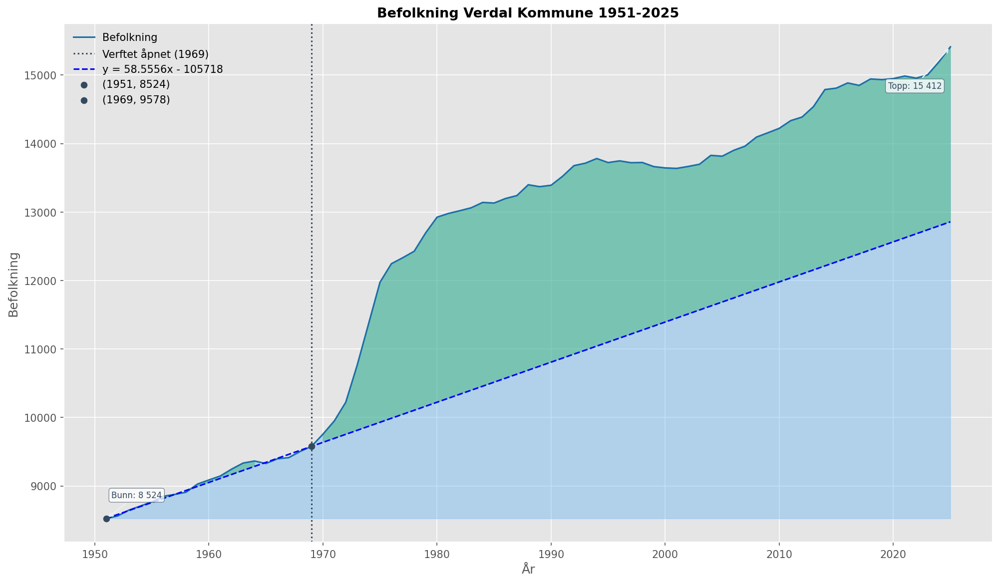
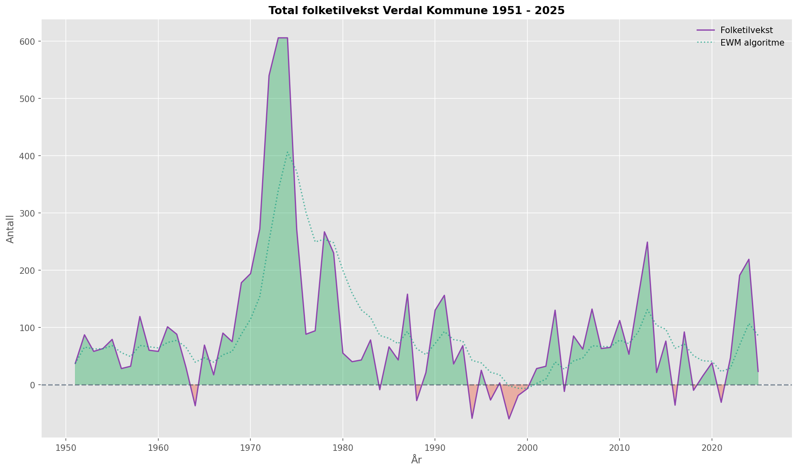
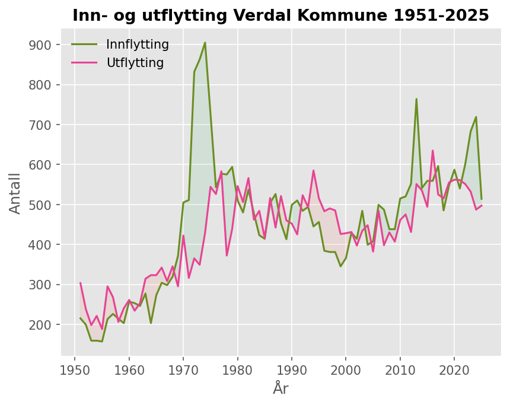
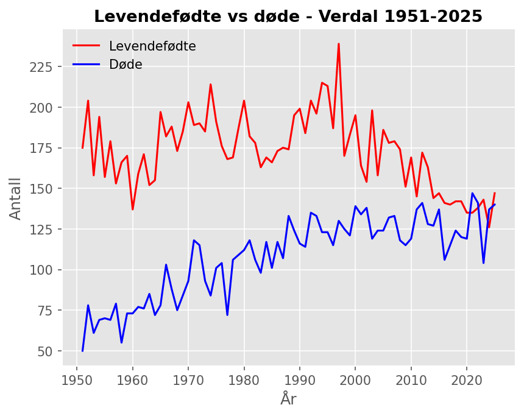
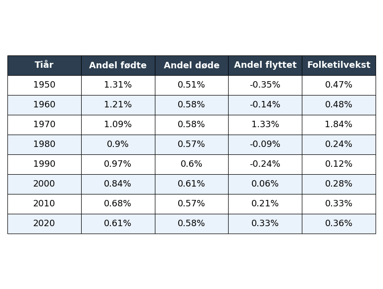
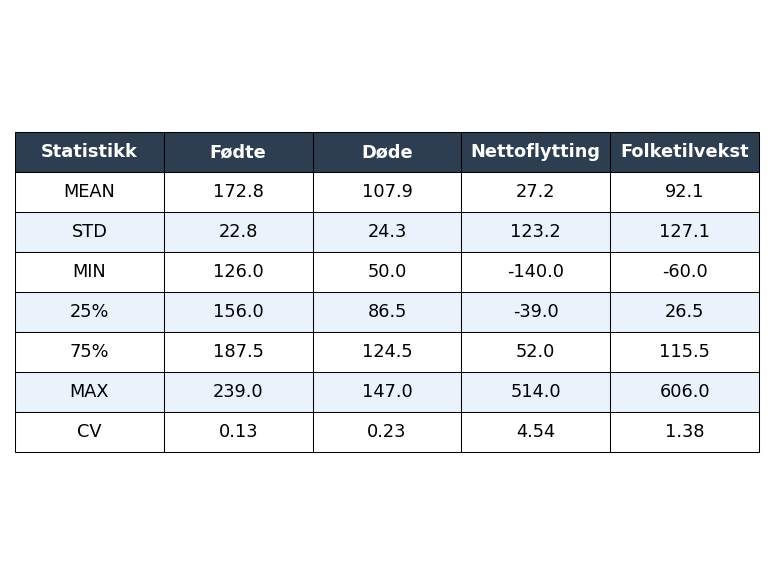

## Befolkningsanalyse av Verdal Kommune 1951-2025 (R1)

Prosjektet lager grafer befolkningstall i Verdal. Data hentet fra Statistisk sentralbyrå [[ssb.no/statbank/table/06913]](https://www.ssb.no/statbank/table/06913)

### 1. Data
Programmet trenger CSV-filen `data.csv` eller `ubehandlet_data.csv`, som må ligge i samme mappe som programmet.


### 2. Requirements
Programmet trenger noen eksterne biblioteker. Kjør derfor denne kommandoen i terminalen:


```bash
pip install -r requirements.txt
```


### 3. Innstillinger
I `konfig.py` ligger noen `bool`-variabler. 
- `SKRIV_TIL_PNG` Lager png fil (*True*) eller lager vindu (*False*)
- `LOGGING` Loggfører prosesser underveis til terminalen


### 4. Kjøring
I terminalen, kjør denne kommandoen:

```bash
python main.py
```


### 5. Resultat
Programmet vil lage en mappe `grafer` og legger inn grafene i png-format.

Mange mattefaglige poenger er klare til bruk, men kommentert ut. Disse finner du i grafer.py, og du kan endre på dem som du vil.


**Utvalgte bilder fra projektet:**







